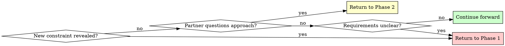

# Brainstorming Ideas into Designs

## Overview

Transform rough ideas into fully-formed designs through structured questioning
and alternative exploration.

**Core principle:** Ask questions to understand, explore alternatives, present
design incrementally for validation.

**Announce at start:** "I am using the brainstorming skill to refine your idea
into a design."

## Quick Reference

| Phase | Key Activities | Output |
|-------|---------------|--------|
| **1. Understanding** | Ask questions (one at a time) | Purpose, constraints, criteria |
| **2. Exploration** | Propose 2-3 approaches | Architecture options with trade-offs |
| **3. Design Presentation** | Present in 200-300 word sections | Complete design with validation |
| **4. Documentation** | Write design document | Design doc in docs/plans/ |
| **5. Handoff** | Create implementation plan | Ready for development |

## The Process

**Track progress:** Use @templates/progress-checklist.md to track phases.

### Phase 1: Understanding
- Check current project state in working directory
- Ask ONE question at a time to refine the idea
- **Use AskUserQuestion tool** when you have multiple choice options
- Gather: Purpose, constraints, success criteria

**Example:** Use AskUserQuestion for storage choice (session storage vs local storage vs cookies with trade-offs). See @examples.md for full sessions.

### Phase 2: Exploration
- Propose 2-3 different approaches
- For each: Core architecture, trade-offs, complexity assessment
- **Use AskUserQuestion tool** to present approaches as structured choices
- Ask user which approach resonates

**Example:** Use AskUserQuestion for architecture (event-driven vs direct API vs hybrid with trade-offs). See @examples.md for full sessions.

### Phase 3: Design Presentation
- Present in 200-300 word sections
- Cover: Architecture, components, data flow, error handling, testing
- Ask after each section: "Does this look right so far?" (open-ended)
- Use open-ended questions here to allow freeform feedback

### Phase 4: Design Documentation
After design is validated, write it to a permanent document:
- **File location:** `docs/plans/YYYY-MM-DD-<topic>-design.md` (use actual date and descriptive topic)
- **RECOMMENDED SUB-SKILL:** Use elements-of-style:writing-clearly-and-concisely (if available) for documentation quality
- **Content:** Capture the design as discussed and validated in Phase 3, organized into the sections that emerged from the conversation
- Commit the design document to git before proceeding

### Phase 5: Handoff to Implementation
When design is approved:
- Ask: "Ready to create an implementation plan?"
- If yes, use `/plan` command or create plan manually
- Optionally set up git worktree for isolated development: `git worktree add ./tree/<branch> -b <branch>`

## Question Patterns

### When to Use AskUserQuestion Tool

**Use for:**
- Phase 1: Clarifying questions with 2-4 clear options
- Phase 2: Architectural approach selection (2-3 alternatives)
- Decisions with distinct, mutually exclusive choices
- Options with clear trade-offs

**Benefits:** Structured presentation, trade-off visibility, forces explicit choice.

### When to Use Open-Ended Questions

**Use for:**
- Phase 3: Design validation ("Does this look right so far?")
- Detailed feedback or explanation needed
- Partner should describe their own requirements
- Structured options would limit creative input

See @examples.md for complete question pattern examples.

## When to Revisit Earlier Phases

**You can and should go backward when:**
- Partner reveals new constraint during Phase 2 or 3 → Return to Phase 1
- Validation shows fundamental gap in requirements → Return to Phase 1
- Partner questions approach during Phase 3 → Return to Phase 2
- Something doesn't make sense → Go back and clarify

**Don't force forward linearly** when going backward would give better results.

## Key Principles

| Principle | Application |
|-----------|-------------|
| **One question at a time** | Phase 1: Single question per message, use AskUserQuestion for choices |
| **Structured choices** | Use AskUserQuestion tool for 2-4 options with trade-offs |
| **YAGNI ruthlessly** | Remove unnecessary features from all designs |
| **Explore alternatives** | Always propose 2-3 approaches before settling |
| **Incremental validation** | Present design in sections, validate each |
| **Flexible progression** | Go backward when needed - flexibility > rigidity |
| **Announce usage** | State skill usage at start of session |
